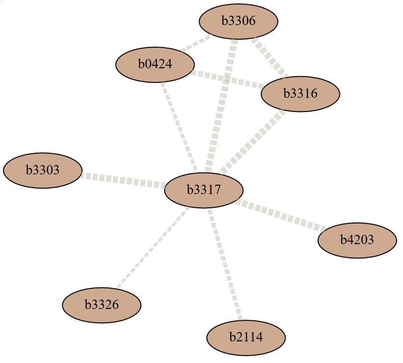

# Protein-Protein Interaction Network and Functional Annotation Database

写不出写不出写不出写不出写不出写不出写不出写不出写不出写不出写不出写不出写不出写不出写不出写不出写不出写不出写不出写不出写不出写不出写不出写不出写不出写不出写不出写不出写不出写不出写不出写不出写不出写不出写不出写不出写不出写不出写不出写不出写不出写不出写不出写不出写不出写不出写不出写不出写不出写不出写不出写不出写不出写不出写不出写不出写不出写不出写不出写不出写不出写不出写不出写不出写不出写不出写不出写不出写不出写不出写不出写不出写不出写不出写不出写不出啊啊啊啊啊啊啊啊


## :microscope: ​Introduction

pass


## :wrench: Installation

pass


## :computer: ​Back-end

### Database Design :card_file_box: 

* `species_protein` table

  This table records the name of protein and the corresponding species, including *E. coli* and *S. cerevisiae*.

  | Column Name | Data Type  | Constraints | Description                                                |
  | ----------- | ---------- | ----------- | ---------------------------------------------------------- |
  | protein_id  | String(10) | Primary Key | The name (ID) of the protein                               |
  | species     | String(20) | NOT NULL    | The name of the species from which this protein originates |
  
  

* `go_info` table

  This table records the basic information of each GO term, including its name, category and description in details.

  | Column Name | Data Type   | Constraints           | Description                                                  |
  | ----------- | ----------- | --------------------- | ------------------------------------------------------------ |
  | id          | String(15)  | Primary Key, NOT NULL | The ID of each GO term, serving as a unique identifier.      |
  | name        | String(200) | NOT NULL              | The name of the GO term                                      |
  | category    | String(20)  | NOT NULL              | The category of the GO term, including biological process, molecular function and cellular component |
  | description | Text        | NOT NULL              | A detailed description of the GO term                        |

  

* `go_interaction` table

  This table records a directed relationship between two GO terms in each row. One GO term may have different relationships with different other terms.

  | Column Name  | Data Type  | Constraints                          | Description                                                  |
  | ------------ | ---------- | ------------------------------------ | ------------------------------------------------------------ |
  | index        | Integer    | Primary Key, NOT NULL                | A unique identifier for each record in the table             |
  | go_id        | String(15) | Foreign Key (`go_info.id`), NOT NULL | The source GO term in this relationship, which is a foreign key from the `id` field in `go_info` |
  | relationship | String(50) | NOT NULL                             | The type of relationship between the two GO terms, including `is_a`, `part_of`, `positively_regulates`, `negatively_regulates` and `regulates` |
  | target_go_id | String(15) | Foreign Key (`go_info.id`), NOT NULL | The target GO term in this relationship, which is a foreign key from the `id` field in `go_info` |

  
  
* `Ecoli_interaction_score` table & `Scer_interaction_score` table

  These two tables document key protein-protein interactions in *E. coli* and *S. cerevisiae*. The first two columns represent the two proteins involved in the interaction, while the third column provides the interaction score. This score is calculated by integrating probabilities from various evidence channels and adjusting for the likelihood of randomly observing an interaction.

  | Column Name       | Data Type  | Constraints                                                  | Description                                                  |
  | ----------------- | ---------- | ------------------------------------------------------------ | ------------------------------------------------------------ |
  | protein_a         | String(10) | Primary Key, Foreign Key (`species_protein.protein_id`), NOT NULL | One of the protein in the interaction, which is a foreign key from the `protein_id` field in `species_protein` |
  | protein_b         | String(10) | Primary Key, Foreign Key (`species_protein.protein_id`), NOT NULL | One of the protein in the interaction, which is a foreign key from the `protein_id` field in `species_protein` |
  | interaction_score | Integer    | NOT NULL                                                     | The interaction score given by combining the probabilities from the different evidence channels |


* `Ecoli_validation` table & `Scer_validation` table

  These two tables record the experimental validation information of protein-protein interactions in *E. coli* and *S. cerevisiae*. The validation information includes the type of experiment and the PubMed ID of the paper that reports the interaction. An interaction may have been validated by more than one type of experiment or reported in more than one paper.

  | Column Name         | Data Type  | Constraints                                                  | Description                                                  |
  | ------------------- | ---------- | ------------------------------------------------------------ | ------------------------------------------------------------ |
  | protein_a           | String(10) | Primary Key, Foreign Key (`species_protein.protein_id`), NOT NULL | One of the protein in the interaction, which is a foreign key from the `protein_id` field in `species_protein` |
  | protein_b           | String(10) | Primary Key, Foreign Key (`species_protein.protein_id`), NOT NULL | One of the protein in the interaction, which is a foreign key from the `protein_id` field in `species_protein` |
  | experiment_approach | String(30) | Primary Key, NOT NULL                                        | The type of experiment that has validated this interaction   |
  | pubmed_id           | String(20) | Primary Key, NOT NULL                                        | The paper that reports this interaction                      |


* TBC...


### API Design​ :mag_right:

#### Retrieve GO term description and GO interaction

pass


#### Retrieve protein interaction information and visualization

This API allows users to query interactions for a given protein in a specific species, returning interaction details and an interaction network visualization graph. The interaction details include two interacting proteins, their interaction score, the publications reporting the interaction, and the experimental methods used to discover the interaction.

* Endpoint: `GET /interaction-search`

* Request Parameters:

  | Parameter   | Data Type | Required | Description                                                  |
  | ----------- | --------- | -------- | ------------------------------------------------------------ |
  | `protein`   | `string`  | Yes      | The ID of the protein to query                               |
  | `species`   | `string`  | Yes      | The species name of the queried protein (`E.coli` and `S.cerevisiae` supported) |
  | `min_score` | `float`   | No       | The minimum interaction score threshold (default: `0`)       |

* Example Request URL:

  ```
  http://127.0.0.1:5000/interaction-search?protein=B3317&species=E.coli&min_score=800
  ```

* Response Structure:

  | Field                         | Type     | Description                                                  |
  | ----------------------------- | -------- | ------------------------------------------------------------ |
  | `protein`                     | `string` | The queried protein ID                                       |
  | `species`                     | `string` | The species name of the queried protein                      |
  | `interactions`                | `array`  | List of interaction details                                  |
  | \|-- `protein_a`              | `string` | Protein_a in the interaction found                           |
  | \|-- `protein_b`              | `string` | Protein_b in the interaction found                           |
  | \|-- `interaction_score`      | `float`  | The score of this interaction. The higher, the more reliable |
  | \|-- `validations`            | `array`  | The experimental validations for this interaction            |
  | \| \|-- `experiment_approach` | `string` | The experimental method used for validation                  |
  | \| \|-- `pubmed_id`           | `string` | The PubMed ID of the paper validated this interaction        |
  | `graph_svg`                   | `string` | The interaction network graph in SVG format                  |

* Error Codes

  | HTTP Status Code | Description                                           |
  | ---------------- | ----------------------------------------------------- |
  | `400`            | Invalid species name                                  |
  | `404`            | Invalid protein name or protein not found in database |
  | `500`            | Unexpected error                                      |

* Notes:

  * Case Insensitivity: The letters in protein IDs of E.coli will be automatically normalized to lowercase, while the letters in protein IDs of S.cerevisiae will be automatically normalized to uppercase.

  * Interaction Graph: The `graph_svg` field contains an SVG string representing the interaction network. The graph includes proteins that interact with the query protein, as well as interactions between these proteins. The thickness of the edges represents the interaction score, with thicker edges indicating higher scores. An example is given below:

      ​

    

