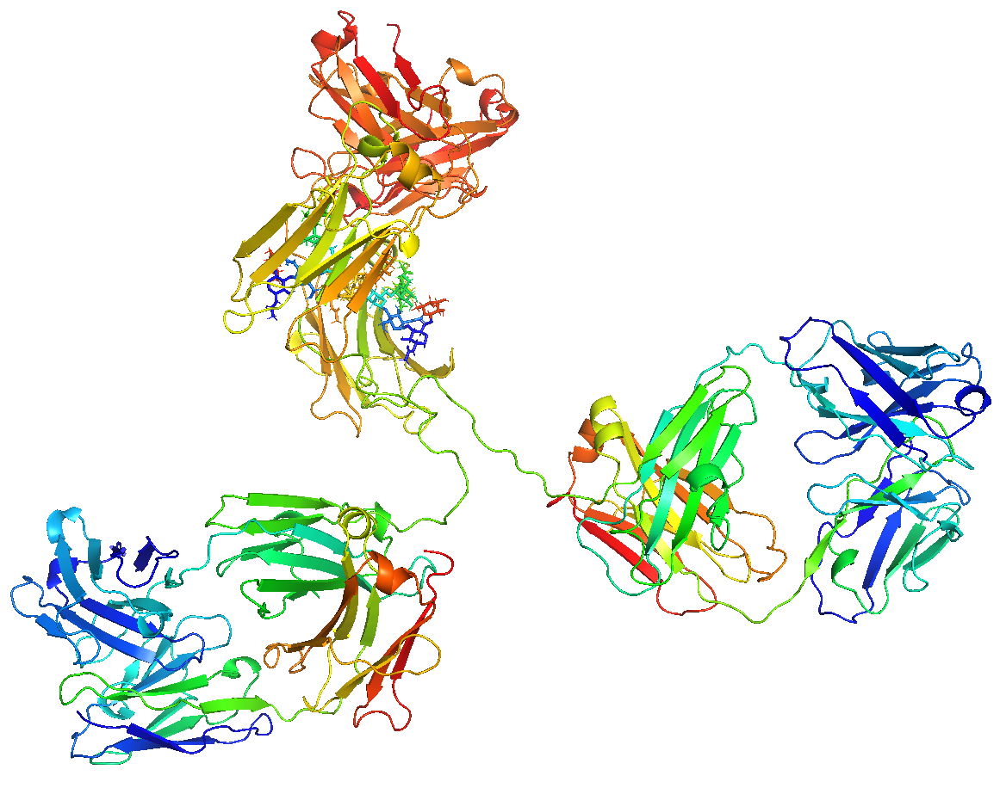
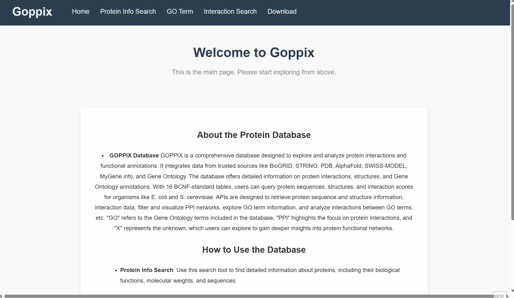
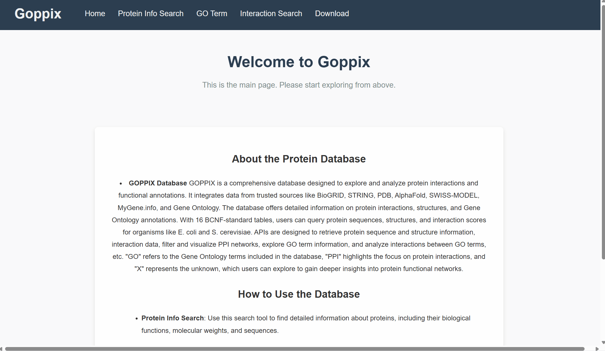
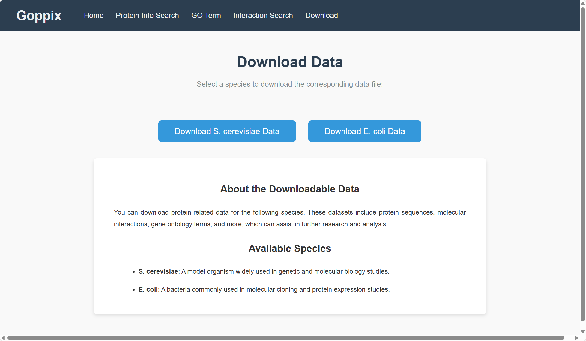

<div align="center">
    <h1>
    GOPPIX: Protein-Protein Interaction Network and Functional Annotation Database
    </h1>
    <p>
    Project of BIO3514 Database Principle, 2024 Autumn, SJTU
    <br />
    <a href="https://github.com/Cannizzaro-reaction"><strong>Cannizzaro-reaction</strong></a>
    &nbsp;
    <a href="https://github.com/KKrookie"><strong>KKrookie</strong></a>
    &nbsp;
    <a href="https://github.com/xywawawa"><strong>xywawawa</strong></a>
    &nbsp;
    </p>
    <p>
    <a href="https://github.com/Cannizzaro-reaction/Goppix"></a>
    <a href="https://github.com/Cannizzaro-reaction/Goppix?tab=MIT-1-ov-file"></a>
    </p>
    
</div>

## :microscope:Introduction

**GOPPIX Database** is a comprehensive resource designed to facilitate the exploration and analysis of protein interactions and functional annotations. This database integrates data from multiple reliable sources, such as BioGRID, STRING, PDB, AlphaFold, SWISS-MODEL, MyGene.info, and the Gene Ontology database. The dataset encompasses detailed information about protein interactions, experimental validation, protein structures (primary, secondary, and tertiary), and functional annotations using Gene Ontology (GO) terms.

With 16 meticulously designed tables conforming to the BCNF standard, the database supports a range of queries. Users can retrieve detailed protein information (such as sequences, structures, and GO annotations), explore GO term descriptions and interactions, analyze protein-protein interaction scores, and even download comprehensive datasets for specific species. Supported organisms include *Escherichia coli* and *Saccharomyces cerevisiae*.

The database also features a suite of APIs for retrieving and visualizing interaction networks, enabling researchers to perform targeted queries and gain insights into protein functionality and interaction mechanisms. This resource is an essential tool for researchers in the fields of bioinformatics, molecular biology, and systems biology, offering robust data and functionality to support advanced analysis.

GOPPIX is a name given by ChatGPT. GO represents the Gene Ontology annotations included in our database, while PPI highlights our database's focus on protein-protein interaction data within organisms. "X" signifies the unknown, which users can explore through our database to gain deeper insights into protein functional networks and uncover the unknown.


## :hammer:Installation

* Create environment:

  Go to the directory of environment file:

  ```bash
  cd environment
  ```

  Create environment using Anaconda:

  ```bash
  conda env create -f environment.yml
  ```

  If there's anything wrong in environment, you can choose to set up manually:

  ```
  conda create -n goppix python=3.8
  pip install pandas flask flask-sqlalchemy flask-restful python-dotenv graphviz pymysql
  ```

  Every time you use this database, remember to activate the environment by:

  ```
  conda activate goppix
  ```

* Database setup:

  Go to *web* directory. Edit the `.env` file to include your database credentials. If there's no `.env` file, you may have to manually create one with the following format:

  ```
  MYSQL_USER_NAME=your_database_user
  MYSQL_USER_PASSWORD=your_database_password
  MYSQL_HOSTNAME=your_database_host
  MYSQL_PORT=your_database_port
  MYSQL_DATABASE_NAME=goppix
  SECRET_KEY=your_secret_key
  JWT_SECRET_KEY=your_jwt_secret
  FLASK_CONFIG=development
  SQLALCHEMY_DATABASE_URI=mysql+pymysql://<your_database_user>:<your_database_password>@<your_database_host>:<your_database_port>/goppix
  ```

  Change `<>` according to your database configuration.

  Create the database:

  ```bash
  mysql -u <DB_USER> -p -e "CREATE DATABASE goppix;"
  ```

  Import data:

  ```
  cd scripts
  python setup.py
  ```

  An alternative way to import database is to directly import from `goppix.sql` file, which is placed in the root directory:

  ```
  mysql -u <DB_USER> -p goppix < goppix.sql
  ```

  After setup, test in your MySQL, and your database will look something like this:

  ```mysql
  mysql> USE goppix;
  Reading table information for completion of table and column names
  You can turn off this feature to get a quicker startup with -A
  
  Database changed
  mysql> SHOW TABLES;
  +---------------------------+
  | Tables_in_goppix          |
  +---------------------------+
  | Ecoli_interaction_score   |
  | Ecoli_primary_structure   |
  | Ecoli_protein_go          |
  | Ecoli_secondary_structure |
  | Ecoli_tertiary_structure  |
  | Ecoli_validation          |
  | Scer_interaction_score    |
  | Scer_primary_structure    |
  | Scer_protein_go           |
  | Scer_secondary_structure  |
  | Scer_tertiary_structure   |
  | Scer_validation           |
  | go_basic                  |
  | go_detail                 |
  | go_interaction            |
  | species_protein           |
  +---------------------------+
  16 rows in set (0.01 sec)
  ```

  If there's anything wrong in this process, you can also import data is by running all the `run` functions in the `scripts` directory. Before that, remember to run `app.py` to create all tables.

* After that, you can start this application with:

  ```bash
  python app.py
  ```


## :mag:Usage

In `Protein Info Search`, you can get basic information about a protein in E.coli or S.cerevisiae using protein ID. The basic information includes species, primary structure, secondary structure (presented in C, B, H and T), and a link to download the tertiary structure in `.pdb` format. Besides, you can also get a list of GO terms related with this protein, as long as the name and category of each term.

<div align="center">
    
</div>

This type of search can be performed using protein sequences.

<div align="center">
    
</div>

In `GO Term` page, you can get basic information about a GO term, including its name, category and a simple description of this term. Other GO terms related with your query will also be shown, as well as the type of relationship between these two terms.

<div align="center">
    
</div>

In `Interaction Search`, you can get the information about protein-protein interaction for your query protein. This includes the species to which the protein belongs, the identifiers of interacting proteins, interaction scores, and the research studies that validate these interactions. You can also find links to the published articles of these studies. Additionally, you have the option to set a minimum interaction score to filter for protein pairs with higher confidence. At the bottom of the page, you will see an automatically generated protein interaction network, providing a more intuitive visualization of the search results. The thicker the edges in the network, the higher the confidence of the interaction pair.

<div align="center">
    
</div>

In `Download` page, You can get a detailed list of protein interaction in `.csv` format for your chosen species.

<div align="center">
    
</div>

